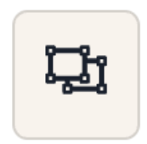

# User story 10: [As a traveller, I want to be able to add custom categories so that I can personalize my transactions to have a more detailed record](https://github.com/Taehoya/Adventure-Audit/issues/34)

Expected condition:

1. Logged in successfully
2. Trip added with the following information:
   1. Trip title: “Japan with friends”
   2. Start date: “2023-06-01”
   3. End date: “2023-06-22”
   4. Destination: “Japan”
   5. Budget: “100000”

---

Test:

1. Click on the “Japan with friends” button on the left sidebar under “UPCOMING”
2. Click on the  button in the top right corner of the screen
3. Click on the  button in the top right corner of the screen
4. Click “Add” button in the bottom right corner
5. Type “Coffee” for the category name.
6. Click “Add” button in the bottom right corner
7. Choose the icon :
8. Select colour:
   1. Drag the slider to any colour
   2. Click on the very first block of colour beneath the slider
9. Click “Add” button in the bottom right corner right
10. Click on the  button in the top right corner of the screen
11. Fill in the form from top to bottom in order:
    1. Item details: “Coffee”
    2. Amount: “2500”
    3. Date: “2023-06-03 7:00 PM”
    4. Category: Click on the newly added category
    5. Leave the Notes empty
12. Click on the “Save” button in the bottom left corner of the form

---

Expected result:

1. New categories with the selected icon and colour should show up in the list of categories when successfully added.
2. Trying to click “Add” should give an error about the empty entries except for the colour
3. The colour is optional to select. If not selected, the colour of the category will stay white.
4. Newly added transaction with the custom category should appear in the transaction list
