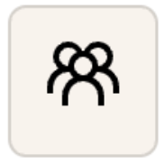

# User story 12: [As a transaction payer, when I add a transaction, I want to be able to select the other users that I paid for, so that we can divide the cost later](https://github.com/Taehoya/Adventure-Audit/issues/46)

Expected condition:

1. Logged in successfully
2. Trip added with the following information:
   1. Trip title: “Japan with friends”
   2. Start date: “2023-06-01”
   3. End date: “2023-06-22”
   4. Destination: “Japan”
   5. Budget: “100000”
   6. There are the following members part of the trip “Japan with friends”
      1. “Suhjin Kang”
      2. “Luke Lepa”
      3. “Taeho Choi”
      4. “Leonardo Warsito”

---

Test:

1. Click on the “Japan with friends” button on the left sidebar under “UPCOMING”
2. Click on the  button in the top right corner of the screen
3. Click on the “+” button in the top right corner of the screen
4. Fill in the form from top to bottom in order:
   1. Item details: “breakfast”
   2. Amount: “90”
   3. Date: “2023-06-01 8:30 AM”
   4. Category: first icon button (top left corner)
   5. Leave the Notes empty
   6. Related members: “Suhjin Kang”
   7. Who paid?: “Suhjin Kang”
   8. Related members: “Luke Lepa”, “Taeho Choi”
5. Click on the “Save” button in the bottom left corner of the form
6. Click on the transaction “breakfast”

---

Expected result:

1. Step 4-7 should uncheck “Suhjin Kang” from the “Related Members” and disabled from checking the checkbox.
2. A new transaction should show up on the transactions section with the name “breakfast” which the column of “Payers” with 3 profile avatars representing the 3 users
3. Clicking on the transaction should show the details of the transaction on the right side of the screen, which should also show the 3 users under “Payers:”
