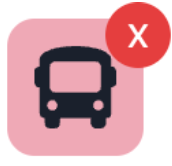

# User story 15: [As a traveller, I want to be able to view my transactions in a pie chart by category so that I can see where I spent the most money](https://github.com/Taehoya/Adventure-Audit/issues/52)

Expected condition:

1. Logged in successfully
2. Trip added with the following information:
   1. Trip title: “Japan with friends”
   2. Start date: “2023-06-01”
   3. End date: “2023-06-22”
   4. Destination: “Japan”
   5. Budget: “100000”
   6. There are the following members part of the trip “Japan with friends”
      1. “Suhjin Kang”
      2. “Luke Lepa”
      3. “Taeho Choi”
      4. “Leonardo Warsito”
3. Transaction added with the following information:
   1. Item details: “breakfast”
   2. Amount: “1500”
   3. Date: “2023-06-01 8:30 AM”
   4. Category: 
   5. Leave the Notes empty
   6. Who paid?: “Suhjin Kang”
   7. Related members: “Luke Lepa”, “Taeho Choi”
4. Transaction added with the following information:
   1. Item details: “Ticket to museum”
   2. Amount: “3900”
   3. Date: “2023-06-05 10:00 AM”
   4. Category: 
   5. Leave the Notes empty
   6. Who paid?: “Leonardo Warsito”
   7. Related members: “Suhjin Kang”
5. Transaction added with the following information:
   1. Item details: “gifts for family”
   2. Amount: “10004”
   3. Date: “2023-06-04 12:00 PM”
   4. Category: 
   5. Leave the Notes empty
   6. Who paid?: “Suhjin Kang”
   7. Related members: empty
6. Transaction added with the following information:
   1. Item details: “hotel”
   2. Amount: “50000”
   3. Date: “2023-06-01 12:00 PM”
   4. Category: 
   5. Leave the Notes empty
   6. Who paid?: “Suhjin Kang”
   7. Related members: empty
7. Transaction added with the following information:
   1. Item details: “bus fares”
   2. Amount: “4000”
   3. Date: “2023-06-04 12:00 PM”
   4. Category: 
   5. Leave the Notes empty
   6. Who paid?: “Suhjin Kang”
   7. Related members: empty

---

Test:

1. Click on the “Japan with friends” button on the left sidebar under “UPCOMING”
2. Click on the  button on top of the 3rd column

---

Expected result:

1. On the top of the “Report” section, it should display a pie chart with all the categories
2. Clicking on each of the categories should display the category icon and the amount spent on the category in the centre of the pie chart
